# Convolutional GANs for CIFAR-10: A Study on Noise Influence

>In this project, I explore the capabilities of Generative Adversarial Networks (GANs), focusing on the integration of convolutional layers to generate images from a specific class within the CIFAR-10 dataset. By modifying the generator and discriminator architectures and experimenting with different types of noise vectors, I wanted to understand how these factors influence the quality and diversity of generated images.

## Experiments and Findings
### Overview
The CIFAR-10 dataset, known for its variety of images spanning ten classes, serves as an ideal benchmark for evaluating the performance of convolutional GANs. I modified both the generator and discriminator of a traditional GAN by introducing convolutional layers, aiming to improve the quality of the generated images. I chose to focus on a single class to keep the scope of my experiment manageable and to observe the nuances in variations more clearly.

### Architectural Modifications
- **Generator**: The enhanced generator architecture incorporates upsampling and convolutional layers, followed by batch normalization and Leaky ReLU activation functions. This setup aims to produce more detailed and high-quality images.
- **Discriminator**: The discriminator is designed with strided convolution layers, allowing for effective discrimination between real and generated images. Batch normalization and dropout are employed to improve training stability.

### Noise Vector Study
The project explores the effect of different noise distributions on image generation, including Gaussian, Uniform, Poisson, Exponential, Laplacian, Bernoulli, and Multiplicative noise. Each noise type contributes uniquely to the diversity and realism of the generated images.

### Experiment Steps:
1. **Loading and Pre-processing Data:** Selected a specific class from CIFAR-10 for targeted image generation.
2. **Building the Generator:** Enhanced the architecture with upsampling and convolutional layers, followed by batch normalization and activation functions (Leaky ReLU and Dropout).
3. **Building the Discriminator:** Implemented strided convolutions for effective discrimination, reshaping the architecture to be more adept at identifying generated images.
4. **Training Loop:** Carefully monitored the GAN's training process, adjusting parameters as needed to improve convergence.
5. **Experimenting with Noise:** Explored various noise distributions including Gaussian, Uniform, Poisson, Exponential, Laplacian, Bernoulli, and Multiplicative noise to see their effects on image generation.
6. **Saving and Loading Model Weights:** Ensured reproducibility and continuity of my experiments by saving and loading the model weights at strategic points. This step was crucial, allowing me to pause and resume my experiments without losing progress, enabling a seamless exploration journey.

### Results
The experiments demonstrate significant variations in image quality and diversity across different epochs and noise types. By the final epoch, the convolutional GANs were able to generate images that closely resemble the target class in the CIFAR-10 dataset, showcasing the potential of convolutional architectures in improving GAN performance.

### Generated Images Over Epochs
- **Epoch 1000:** Early-stage images show basic shapes and colors.

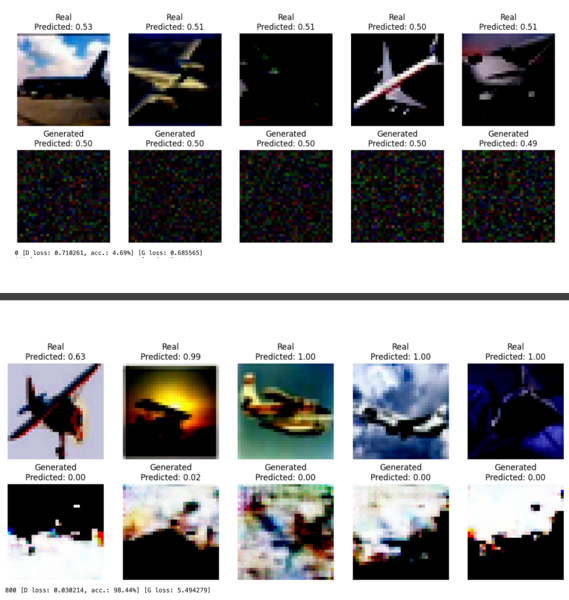
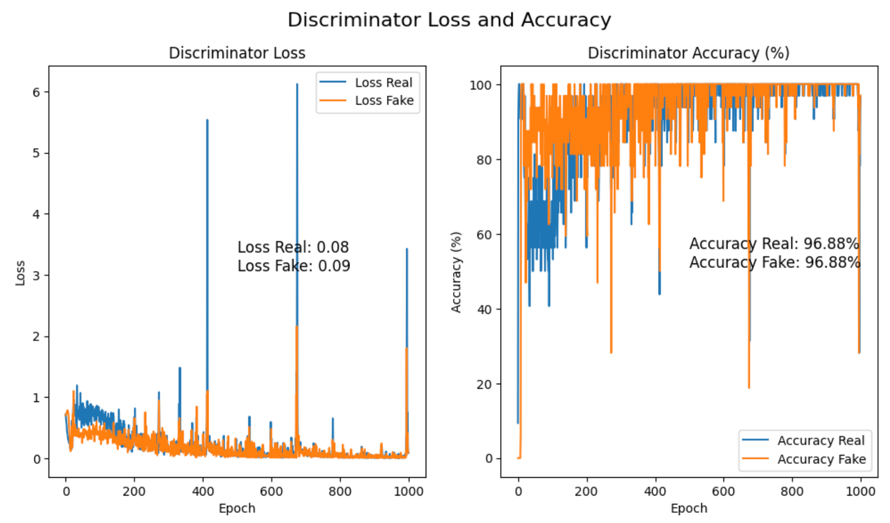

- **Epoch 3500:** More defined structures and patterns emerge.

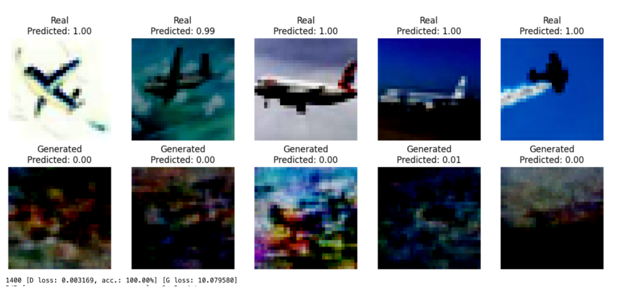
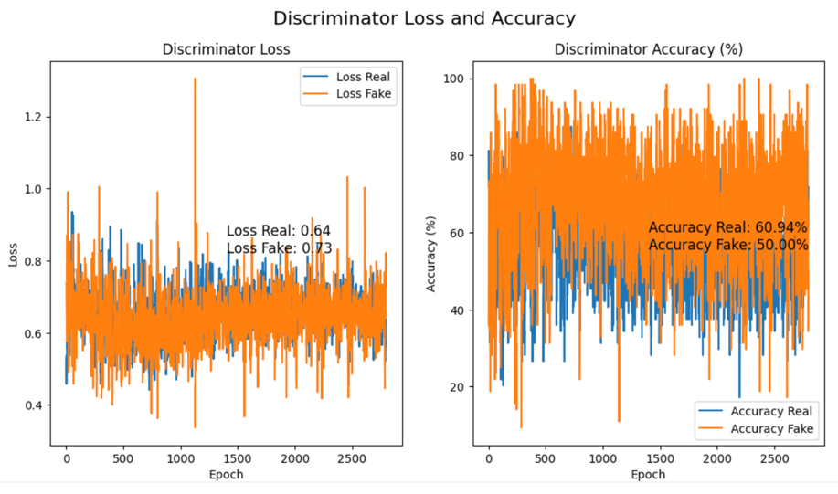

- **Epoch 5500:** Images become clearer with recognizable features.

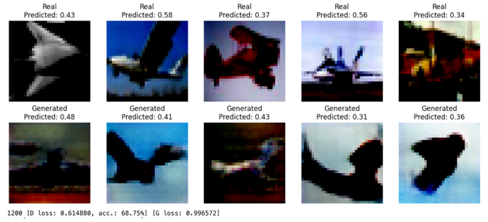
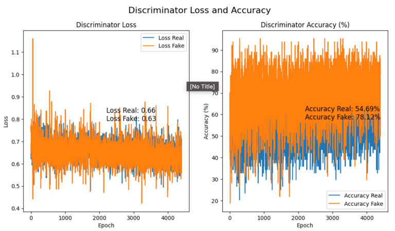

- **Epoch 7500 & 15000:** High-quality images with detailed textures and accurate colors are produced.

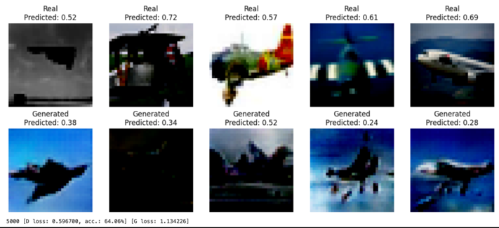
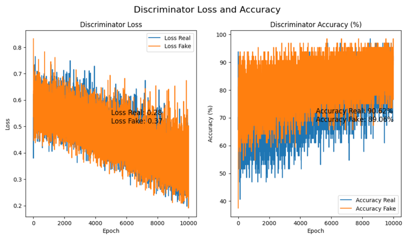

### Effect of Noise Types
I experimented with various noise functions, including Gaussian, Uniform, Poisson, Exponential, Laplacian, Bernoulli, and Multiplicative noises, to control the generator's output. Each noise type influences the image generation process differently, with Gaussian and Uniform noise leading to more coherent and stable image structures, while other types like Poisson and Exponential contribute to the variety in textures and patterns.

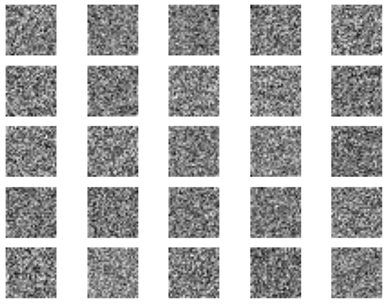 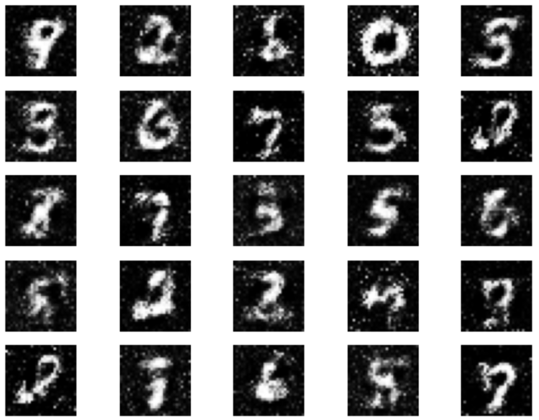
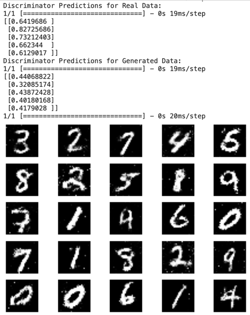

## Technical Implementation

### Dependencies
- TensorFlow
- NumPy
- Matplotlib

### File Structure
MainCifarExperiment.ipynb: Main notebook with GAN model implementation and experiments.
AdditionalExperiments.ipynb: Additional experiments exploring the impact of noise vectors.

### Running the Project
Ensure all dependencies are installed.
Clone the project repository.
Run the Jupyter notebooks to replicate the experiments or explore further modifications.

## Conclusion
This project not only deepened my understanding of GANs and their architectural nuances but also highlighted the significant impact of noise vectors on the generation process. The experimentation with different types of noise was particularly revealing, showcasing the diverse range of images that could be produced by manipulating these inputs.
In conclusion, the project stands as a testament to the potential of convolutional GANs in generating realistic images and the importance of architectural and input variations in shaping the outcome. My exploration into GANs has been both a technical journey and a fulfilling personal endeavor to unravel the complexities of this powerful deep learning model.